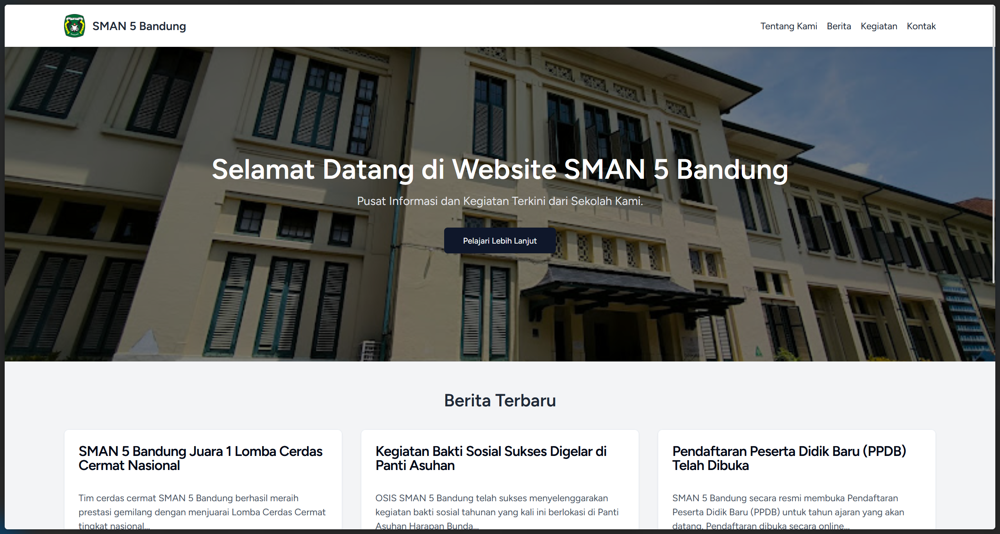

# SMAN 5 Bandung School Website

A modern and functional school website project built with a full-stack technology stack featuring Laravel and React. This project is designed to serve as the main information portal for students, parents, and prospective students, featuring a clean, responsive, and professional user interface.

## Screenshot



## Key Features

-   **Dynamic Homepage:** A landing page that showcases the 3 latest news articles and the 3 most recent activities from the database.
-   **News System:** A complete, database-driven news feature with list and detail pages.
-   **Activity Gallery:** A responsive photo gallery for school activities, laid out in a grid format.
-   **Comprehensive Informative Pages:** A detailed "About Us" page (including History, Vision, and Mission) and a "Contact" page.
-   **Functional Contact Form:** A contact form with robust backend validation (Laravel) and email notification capabilities (tested with Mailtrap).
-   **Modern & Responsive Design:** A fully responsive layout, a sticky header, and a professional UI built with Shadcn UI.
-   **Single-Page Application (SPA) Experience:** Instant navigation between pages with no browser refresh, powered by Inertia.js.

## Tech Stack

This project was built using a modern ecosystem that seamlessly integrates a powerful backend with a dynamic frontend.

### Backend

-   **PHP 8.2+**
-   **Laravel 11**
-   **MySQL / MariaDB**
-   **Eloquent ORM** (for database interaction)
-   **Laravel Mail** (built on Symfony Mailer)

### Frontend

-   **React.js 18**
-   **Inertia.js** (as the "glue" between Laravel and React)
-   **Vite** (for module bundling & HMR)
-   **Tailwind CSS** (for utility-first styling)
-   **Shadcn UI** (a collection of UI components built on Radix UI)

### Development Environment

-   **Composer** (PHP Package Manager)
-   **Node.js & NPM** (JavaScript Package Manager)
-   **Mailtrap** (for local email testing)

## Getting Started: Setup and Installation

Follow these steps to run the project locally.

1.  **Clone this repository:**

    ```bash
    git clone https://github.com/rafliad/Tugas-Praktek-Sertifikasi-Junior-Web-Programmer.git
    cd website-sekolah
    ```

2.  **Install PHP dependencies:**

    ```bash
    composer install
    ```

3.  **Install JavaScript dependencies:**

    ```bash
    npm install
    ```

4.  **Prepare the environment file:**
    Copy the `.env.example` file to `.env`.

    ```bash
    cp .env.example .env
    ```

5.  **Generate the application key:**

    ```bash
    php artisan key:generate
    ```

6.  **Configure your `.env` file:**
    Open the `.env` file and adjust the following variables to match your local environment:

    -   **Database Connection:**
        ```
        DB_CONNECTION=mysql
        DB_HOST=127.0.0.1
        DB_PORT=3306
        DB_DATABASE=db_sekolah
        DB_USERNAME=root
        DB_PASSWORD=
        ```
    -   **Mail Configuration (use your Mailtrap credentials):**
        ```
        MAIL_MAILER=smtp
        MAIL_HOST=sandbox.smtp.mailtrap.io
        MAIL_PORT=2525
        MAIL_USERNAME=...
        MAIL_PASSWORD=...
        MAIL_ENCRYPTION=tls
        MAIL_FROM_ADDRESS="no-reply@sman5bandung.test"
        ```

7.  **Run the database migrations:**
    This command will create all the necessary tables in your database.
    ```bash
    php artisan migrate
    ```

## Running the Application

You need to run **two servers simultaneously** in two separate terminals.

1.  **Terminal 1 - Laravel Backend Server:**

    ```bash
    php artisan serve
    ```

2.  **Terminal 2 - Vite Frontend Server:**

    ```bash
    npm run dev
    ```

3.  Open your browser and visit `http://127.0.0.1:8000`.

## Database Seeding

To populate the database with sample data (for news and activities), use the command below. This command will drop all tables, re-migrate the database schema, and run all seeders.

```bash
php artisan migrate:fresh --seed
```

## License

This project is licensed under the [MIT License](LICENSE.md).
